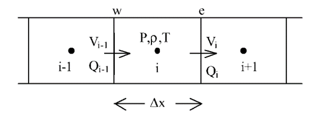

.. _theory_discretized_equations:

=====================
Discretized Equations
=====================

Discretization of Fluid Equations
=================================
The one-dimensional fluid domain is divided into meshes, as shown in Figure :num:`fluidmesh`. A staggered grid is used where quantities like pressure, temperature, density, etc., are defined in the nodes while velocity and flow rates are defined at the faces. However, all the boundary conditions are specified in the nodes, and none are specified in the faces. If velocity needs to be specified in a face, the corresponding mass source is specified as a mass source in the neighboring node. This approach eliminates the need for half/zero control volumes for the momentum equation and significantly simplifies the corresponding modeling and programming difficulties. Continuity equation, energy equation, and equation of state are solved in the nodes, while the momentum equation is solved in the faces between the nodes. In general, a node can be connected to any number of faces.

.. _fluidmesh:

   Schematic of a Fluid Mesh
   
Discretization of Solid Energy Equation
=======================================

The two-dimensional solid domain is divided into meshes, as shown in Figure :num:`solidmesh`.

.. _solidmesh:

   Schematic of a Solid Mesh

On integrating the solid energy equation (Equation :eq:`energy_solid`) in a control volume :math:`P` over 
:math:`dx`, :math:`dy` and :math:`dt`, substituting :math:`\sout{V}_{i,j} = \Delta x \Delta y`, 
:math:`q''' \sout{V}_{i,j} = G` and rearranging, the discretized solid energy equation is obtained as shown in 
Equation :eq:`solid_discrete`.

.. math::
   :label: solid_discrete

   \bar{C}_{pP} \frac{(\rho_P T_P - \rho_P^0 T_P^0) \sout{V}_P}{\Delta t} =
   \left[
     A_e k_e \frac{T_E - T_P}{\Delta x_e} - A_w k_w \frac{T_P - T_W}{\Delta x_w}
   \right](\alpha, 1 - \alpha)
   +
   \left[
     A_n k_n \frac{T_N - T_P}{\Delta y_n} - A_s k_s \frac{T_P - T_S}{\Delta y_s}
   \right](\alpha, 1 - \alpha)
   + G_P (\alpha, 1 - \alpha)
