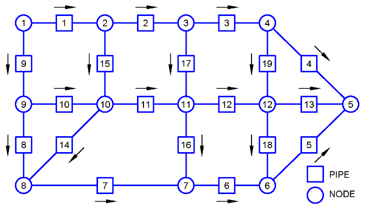

Tutorial 1: Steady-State Flow Distribution in a Water Network
=============================================================

Reference
---------

PINET reference: ``Tutorial 1 - SS flow distribution in a water network.docx``.

OpenSD files:

* :download:`Notebook <../../../tutorials/tutorial1/tutorial.ipynb>`
* :download:`Browser layout <../../../tutorials/tutorial1/geometry.layout.json>`

Problem description
-------------------

A flow circuit as shown below filled with water is considered. The flow distribution in
the network must be estimated for the given boundary conditions. Hazen Williams equation is to
be used for friction loss estimation in the pipes.

   Schematic of Flow Circuit

Modeling steps
--------------

1. Assign node and pipe numbering. An example numbering is shown below:

   Example node and pipe numbering used for input creation.

2. (Note that the directions indicated in the schematic are only assumed directions. If the actual direction is the opposite of the assumed direction, negative flow rate values will be obtained in the results.)

3. In the GUI, create a new flow circuit and assign the specified fluid library.

4. Note user defined fluid library is used here for defining water properties. User-defined fluid "water1.py" must be present in the working directory. Instead, a fluid in CoolProp or thiravam library can also be used.

5. Add the required nodes in the GUI and set their elevations and initial guesses.

6. Note that 12 nodes are required for this problem.

7. Add the required pipes in the GUI, connect the upstream and downstream nodes, and set the pipe geometry and loss model.

8. Note that the pipe geometry data is used in these pipe attributes. Only 1 increment is used for all the pipes since only steady state flow distribution is required. 19 pipes are required to be added for the current problem.

9. Attach the boundary-condition components to the corresponding nodes and set their pressure, temperature, or mass-source values.

10. Note that a negative mass source implies a mass sink from the node.

11. (The reference input file for this tutorial problem is available in ``tutorials/tutorial1.py`` for reference)

Results
-------

Verify the nodal pressures and the element flow rates obtained from the simulation are same as
those given in the tables below, respectively.

.. list-table:: Table 1: Nodal Pressure Values (bar)
   :widths: auto

   * - Node no.
     - 1
     - 2
     - 3
     - 4
     - 5
     - 6
     - 7
     - 8
     - 9
     - 10
     - 11
     - 12
   * - PINET
     - 1.4386
     - 1.3323
     - 1.0463
     - 0.9773
     - 1.0183
     - 0.9711
     - 1.0043
     - 1.0415
     - 1.0780
     - 1.0909
     - 1.0000
     - 1.0036

.. list-table:: Table 2: Element Volumetric Flow Rate Values (l/s)
   :widths: auto

   * - Element
     - 1
     - 2
     - 3
     - 4
     - 5
     - 6
     - 7
     - 8
     - 9
     - 10
   * - PINET
     - 60.66
     - 44.15
     - 17.15
     - -9.83
     - -8.84
     - 12.11
     - 13.55
     - 8.17
     - 43.44
     - -2.59

.. list-table:: Table 3: Element Volumetric Flow Rate Values (l/s) (continued)
   :widths: auto

   * - Element
     - 11
     - 12
     - 13
     - 14
     - 15
     - 16
     - 17
     - 18
     - 19
   * - PINET
     - 8.55
     - -7.17
     - -16.03
     - 5.37
     - 16.51
     - -1.44
     - 27.00
     - 4.29
     - -4.57
