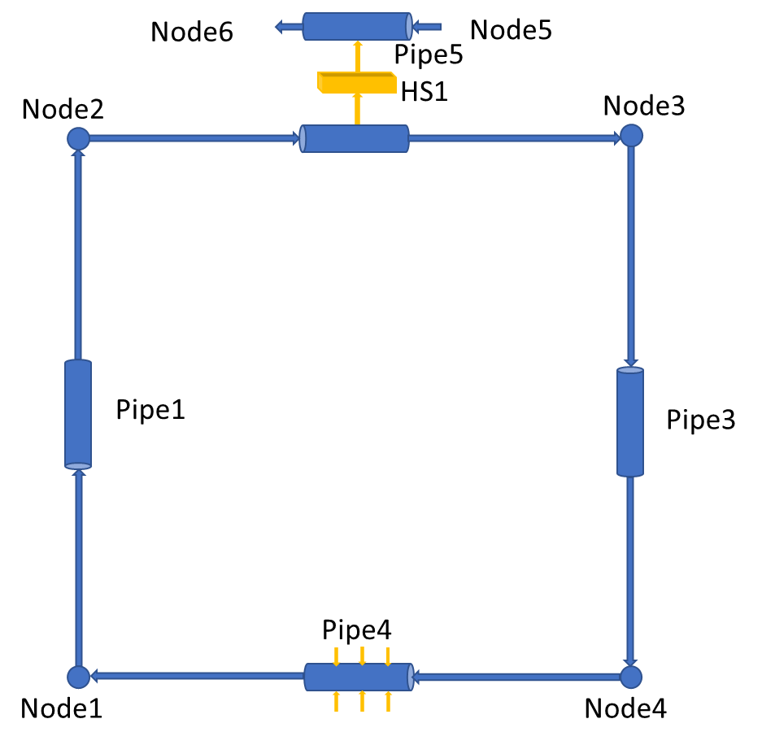
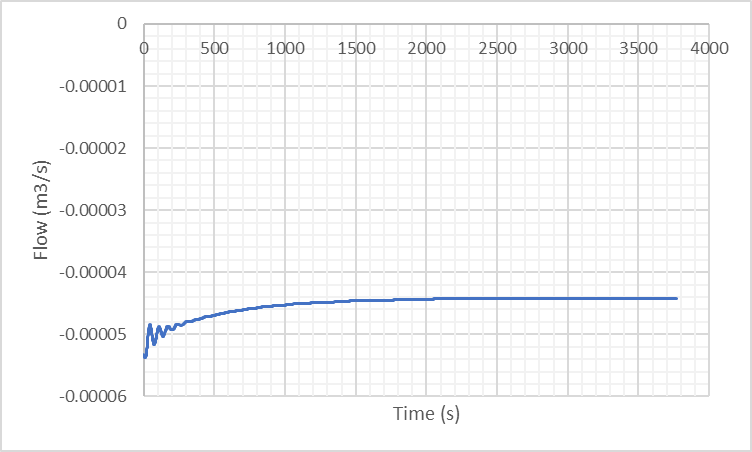
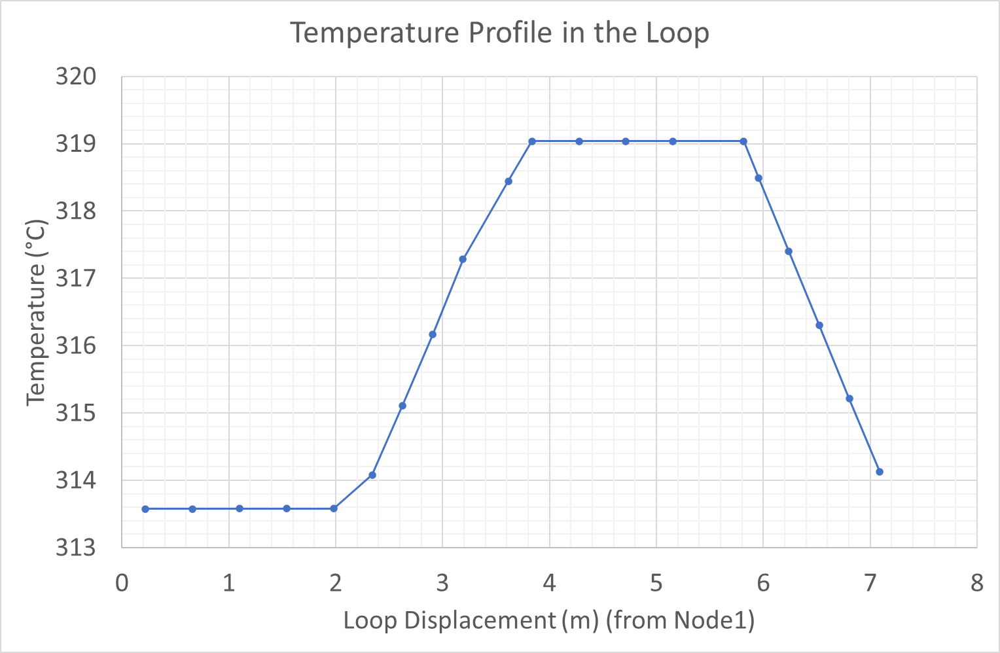

Tutorial 11: Natural Circulation in a closed loop
=================================================

Reference
---------

PINET reference: ``Tutorial 11 - Natural Circulation in a closed loop.docx``.

OpenSD files:

* :download:`Input script <../../../tutorials/tutorial11/tutorial.py>`

Problem description
-------------------

A rectangular natural circulation loop made of glass is considered. The loop has an inside
diameter of 26 mm and an outside diameter of 28 mm. It is filled with water at an operating
pressure of 1 bar. The lengths of the horizontal and vertical legs are 1.415 m and 2.2 m,
respectively. A constant power of 1 kW is added to the bottom horizontal leg. The top horizontal
leg is cooled by a cooler of tube-in-tube configuration, with the inside diameter of the outer
tube being 36 mm. The secondary coolant flow rate is 15 lpm (liters per minute) with an inlet
temperature of 20 degrees C. The steady-state loop flow rate and temperature difference in the
loop must be estimated. The friction factor in the pipes can be assumed as 0.05.

Modeling steps
--------------

1. (Note the input file for this tutorial problem is available in /deck/example17.py)

2. Natural circulation in closed loops is to be solved through transient route only because the steady state solver would fail without specification of flow boundary conditions in any of the nodes in the loop.

3. Draw the layout and label the components for the problem as shown below:

   Closed natural-circulation loop layout.

4. Note that a heat slab with a cooling pipe is used to model sink. The inputs for HS1 and Pipe5 are arbitrary and will not affect the steady state flow rate in the loop. However, these inputs affect the time to attain steady state solution. Hence, inputs giving higher heat transfer rates shall be preferably specified for a quick solution.

5. Create two circuits in the GUI: one main loop circuit and one cooling circuit.

6. Add the required nodes in the GUI and set their elevations and initial guesses.

7. Note that a guess value is specified in a node to create an initial temperature gradient which would help flow initiation in the first iteration. Note that the guess value is to be specified in a node whose conditions are not fixed with boundary conditions which otherwise would be nullified. Also the value needs to be different from the temperature value in the fixed node for gradient generation.

8. Add the pipe components in the GUI, connect the nodes, and enter the geometry, heat input, and loss data.

9. Note that the pipes are incremented (say, 5 nos.) to have more accurate results since cell average densities are used to calculate the driving head for natural circulation.

10. Attach boundary conditions to the nodes

11. Note that the boundary conditions bc4 and bc5 are needed for steady state simulation and need to be removed in transient simulation. Hence, the 'trans' flag in them is made false. Note that the values fixed are arbitrary and will not affect the final steady state results. Note that the sink pipe inlet is fixed at 283 degrees C. Hence, the main loop temperatures will be higher than this value and closer to this if high heat transfer rates are specified in the heat slab.

12. Add the heat slab

13. The inputs above are arbitrary and will not affect the final steady state flow rate in the loop as discussed in Step 1.

14. Set transient parameters

15. Set convergence criteria

16. Note that for natural circulation, since it is difficult to get convergence with default convergence criteria (residue ~10-10), higher residue values (~10-7) are used in the convergence criteria. However, the results obtained are in general accurate enough for practical purposes.

17. Run steady state simulation

18. Notice the energy source associated with the node with fixed temperature. Hence, the results are not correct. This energy source will be removed through transient solution to get the correct result.

19. Run transient simulation till the steady state is reached (~ 1 hr). The evolution of volumetric flow rate in a face is shown below:

   Evolution of volumetric flow rate in a face.

Results
-------

Verify that the mass flow rate (volume flow rate x density) (in any pipe) is equal to 0.04399
kg/s from the output file. The temperature profile in the loop would look as shown below. The
temperature difference between the hot and cold leg should be 5.4597 degrees C.

   Temperature profile in the closed natural-circulation loop.
