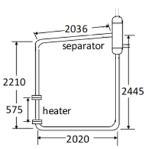

Tutorial 12: Natural Circulation with two-phase flow
====================================================

Reference
---------

PINET reference: ``Tutorial 12 - Natural Circulation with two-phase flow.docx``.

OpenSD files:

* :download:`Input script <../../../tutorials/tutorial12/tutorial.py>`

Problem description
-------------------

A uniform diameter two-phase natural circulation loop, as shown below, with an inside
diameter of 19.9 mm, is considered. The loop is filled with water and is operated at a pressure
of 70 bar. Steam-water separation of 100 % can be assumed in the separator. For an inlet
subcooling of 10 degrees C and power of 25 kW, the steady-state flow rate in the loop and steam
quality at the heater exit must be estimated.

(All dimensions are in mm)

   Flow Circuit for Problem 3.3.3

Modeling steps
--------------

1. The steps are similar to those discussed in tutorials 10 and 11.

Results
-------

The simulation results are given in the table below which shall be verified with the code predictions.

.. list-table:: Table 1: Results
   :widths: auto

   * - Results
     - Benchmark (Flownex code)
     - PINET
   * - Steady state flow rate (kg/s)
     - 0.2901
     - 0.2901
   * - Heater Exit Quality
     - 0.02182
     - 0.02180
