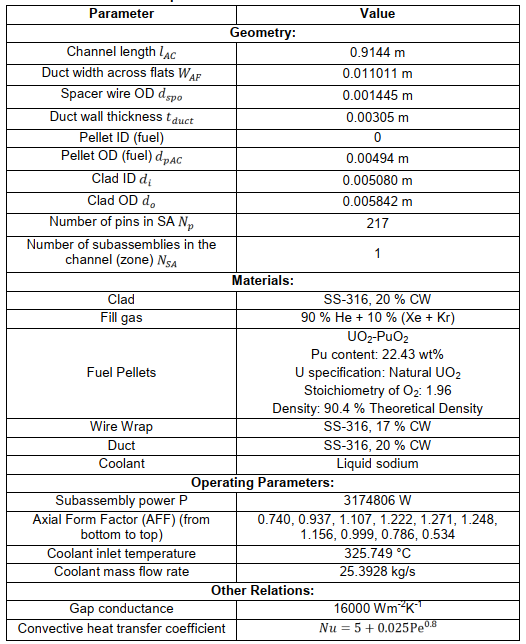
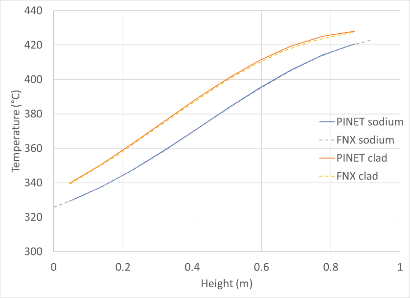
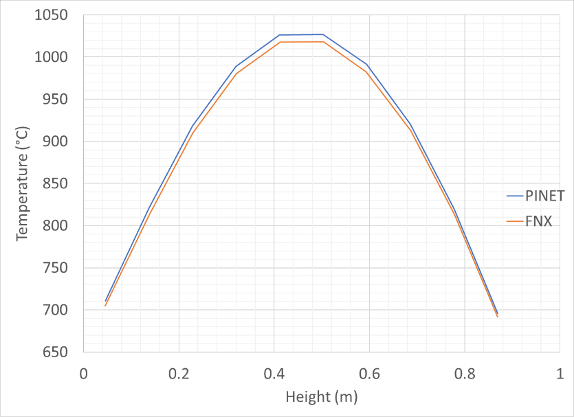
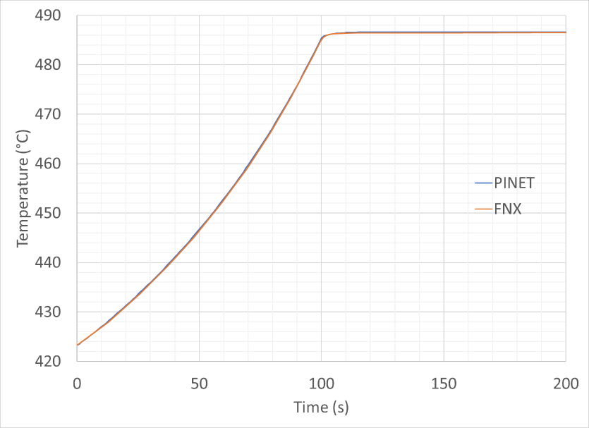
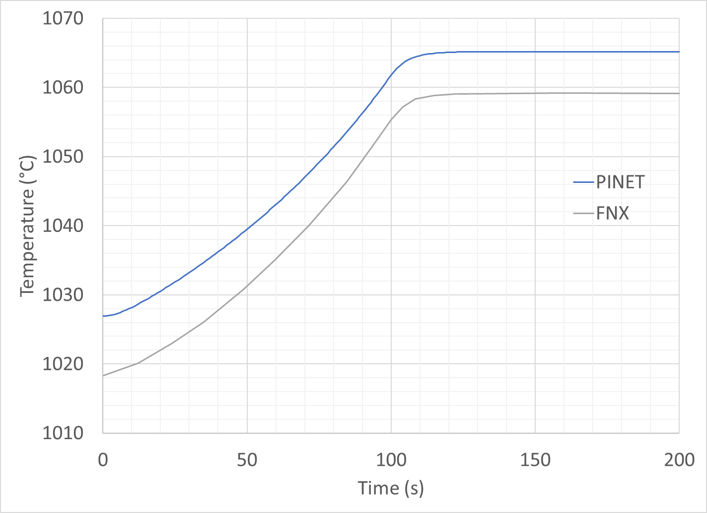

Tutorial 13: FBR Fuel Subassembly Modeling
==========================================

Reference
---------

PINET reference: ``Tutorial 13 - FBR Fuel Subassembly Modeling.docx``.

OpenSD files:

* :download:`Input script <../../../tutorials/tutorial13/tutorial.py>`
* :download:`Browser layout <../../../tutorials/tutorial13/geometry.layout.json>`

Problem description
-------------------

The transient condition for the problem is the ramp decrease of 10 kg/s of coolant mass flow
rate over a period of 100 s .i.e., flow decreases from 25.3928 kg/s to 15.3928 kg/s (~60 %
reduction) over a period of 100 s and remains constant thereafter. Use inbuilt materials.

Modeling steps
--------------

1. The input file for this tutorial problem is saved in /deck/example23.py. The circuit building steps are trivial.

Results
-------

Only the notable points in post processing to get the graphs shown below are listed
below:

For clad temperature, use layer mid-wall (s = 0.5) temperature as shown below:

For fuel centerline temperature, use temperature at s = 0.8 as shown below: (for fuel average
temperature, use temperature at s = 0.2)

(Here s represents normalized layer thickness ranging from 0 (meaning upstream surface) to 1
(meaning downstream surface) )

Steady State Sodium and Clad Temperature Profiles

   Steady State Sodium and Clad Temperature Profiles

Steady State Fuel Centreline Temperature Profile

   Steady State Fuel Centreline Temperature Profile

Transient Evolution of Sodium Outlet Temperature

   Transient Evolution of Sodium Outlet Temperature

Transient Evolution of Fuel Centreline Temperature (At Core Center)

   Transient Evolution of Fuel Centreline Temperature (At Core Center)

   Additional fuel subassembly reference result.
