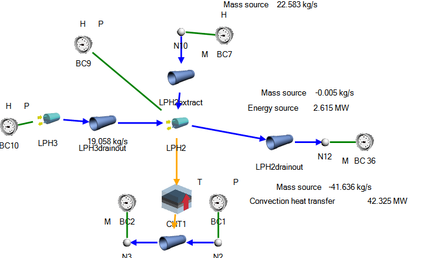

Tutorial 16: Feedwater Heater Modeling
======================================

Reference
---------

PINET reference: ``Tutorial 16 - FWH Modeling.docx``.

No OpenSD tutorial deck for this reference is currently present under ``tutorials/``. Treat this page as a porting checklist until a browser-loadable deck is added.

Problem description
-------------------

A typical power plant's feedwater heater (FWH) must be modeled. A horizontal condensing type
shell and tube heat exchanger is considered. The details of the heater is given in the following
tables (reference: LPH2 in a typical 500 MWe SFR). The change in FWH pressure when the feedwater
flow decreases needs to be quantified.

   Feedwater-heater reference figure from the PINET document.

Modeling inputs
---------------

Geometry
^^^^^^^^

.. list-table:: Table 1: Reference data
   :widths: auto

   * - TP tanks
     - Shape = Vertical Cylinder / Diameter = 3.6 m / Height = 29.88 m
   * - LPH2 extraction steam pipe
     - Length = 20 m / Diameter = 1 m / Roughness = 30 um
   * - LPH2 tubes
     - Length = 25.9 m / Inner Diameter = 17.05 mm / Outer Diameter = 19.05 mm / No. of tubes = 917
   * - LPH3 drain out pipe
     - (20,1,30)
   * - LPH2 drain out pipe
     - (20,1,0.001,66263)

Constitutive relations
^^^^^^^^^^^^^^^^^^^^^^

.. list-table:: Table 2: Reference data
   :widths: auto

   * - Shell side htc
     - 20000
   * - Tube side htc
     - 10000
   * - Tube thermal conductivity
     - 20
   * - Tube specific heat
     - 540
   * - Tube density
     - 7600
   * - Tube friction factor
     - 0.001
   * - Tube K value
     - 676

Boundary conditions
^^^^^^^^^^^^^^^^^^^

.. list-table:: Table 3: Reference data
   :widths: auto

   * - LPH3 enthalpy
     - 484.058
   * - LPH3 pressure
     - 1.57
   * - LPH2 pressure (trans = False)
     - 0.7
   * - LPH2 enthalpy (trans = False))
     - 388.165
   * - Extraction Steam Mass Source
     - 22.5828
   * - Extraction Steam Enthalpy
     - 2054
   * - LPH2 drain out flow rate
     - 41.636
   * - LPH2 tube inlet pressure
     - 20 bar
   * - LPH2 tube inlet temperature
     - 65 degrees C
   * - LPH2 tube flow rate
     - 412

Results
-------

Steady-state results
^^^^^^^^^^^^^^^^^^^^

Boundary-condition results
^^^^^^^^^^^^^^^^^^^^^^^^^^

.. list-table:: Table 4: Reference data
   :widths: auto

   * - Identifier
     - Pressure kPa
     - Temperature degrees C
     - Mass source kg/s
     - Quality
   * - BC1
     - 2000
     - 65
     - 412
     - -0.33572
   * - BC10
     - 157
     - 112.7237
     - 19.058
     - 0.005
   * - BC2
     - 1996.936
     - 89.41784
     - -412
     - -0.28133
   * - BC36
     - 92.67975
     - 89.93311
     - -41.636
     - -0.01406
   * - BC7
     - 70.20795
     - 90.00982
     - 22.5828
     - 0.734419
   * - BC9
     - 70
     - 89.9317
     - -0.0048
     - 0.005

PINET

.. list-table:: Table 5: Reference data
   :widths: auto

   * - Identifier
     - Pressure kPa
     - Temperature degrees C
     - Mass source kg/s
     - Quality
   * - BC1
     - 2000
     - 65
     - x
     - x
   * - BC10
     - 157
     - x
     - x
     -  
   * - BC2
     - x
     - x
     - -412
     - x
   * - BC 36
     - x
     - x
     - -41.636
     - x
   * - BC7
     - x
     - x
     - 22.5828
     - x
   * - BC9
     - 70
     - x
     - x
     -  

Heat-transfer results
^^^^^^^^^^^^^^^^^^^^^

.. list-table:: Table 6: Reference data
   :widths: auto

   * - Identifier
     - {Heat Transfer Element Results,Upstream}Area m^2
     - Convection coefficient W/m^2.K
     - Nusselt number
     - Convection heat transfer MW
     - Radiation heat transfer kW
     - Conduction heat transfer kW
     - Average surface temperature degrees C
     - Maximum surface temperature degrees C
     - Minimum surface temperature degrees C
     - {Heat Transfer Element Results,Downstream}Area m^2
     - Convection coefficient W/m^2.K
     - Nusselt number
     - Convection heat transfer kW
     - Radiation heat transfer kW
     - Conduction heat transfer kW
     - Average surface temperature degrees C
     - Maximum surface temperature degrees C
     - Minimum surface temperature degrees C
   * - CHT1
     - 1421.392
     - 20000
     - 0
     - 42162.63
     - 0
     - 42162.63
     - 88.44856
     - 89.78351
     - 85.05671
     - 1272.165
     - 10000
     - 0
     - 42162.63
     - 0
     - 42162.63
     - 86.88325
     - 89.6271
     - 79.91164

PINET

.. list-table:: Table 7: Reference data
   :widths: auto

   * - Identifier
     - {Heat Transfer Element Results,Upstream}Area m^2
     - Convection coefficient W/m^2.K
     - Nusselt number
     - Convection heat transfer MW
     - Radiation heat transfer kW
     - Conduction heat transfer kW
     - Average surface temperature degrees C
     - Maximum surface temperature degrees C
     - Minimum surface temperature degrees C
     - {Heat Transfer Element Results,Downstream}Area m^2
     - Convection coefficient W/m^2.K
     - Nusselt number
     - Convection heat transfer kW
     - Radiation heat transfer kW
     - Conduction heat transfer kW
     - Average surface temperature degrees C
     - Maximum surface temperature degrees C
     - Minimum surface temperature degrees C
   * -  
     - 1421.392
     - 20000
     -  
     - 42161.1
     -  
     -  
     -  
     -  
     -  
     - 1272.165
     - 10000
     -  
     - 42161.1
     -  
     -  
     -  
     -  
     -  

Node results
^^^^^^^^^^^^

.. list-table:: Table 8: Reference data
   :widths: auto

   * - Identifier
     - Total pressure kPa
     - Static pressure kPa
     - Total temperature degrees C
     - Mass source kg/s
     - Quality
   * - N10
     - 70.20795
     - 69.48486
     - 90.00982
     - 22.5828
     - 0.734419
   * - N12
     - 92.67975
     - 92.67829
     - 89.93311
     - -41.636
     - -0.01406
   * - N2
     - 2000
     - 1998.027
     - 65
     - 412
     - -0.33572
   * - N3
     - 1996.936
     - 1994.933
     - 89.41784
     - -412
     - -0.28133

PINET

.. list-table:: Table 9: Reference data
   :widths: auto

   * - Identifier
     - Total pressure kPa
     - Static pressure kPa
     - Total temperature degrees C
     - Mass source kg/s
     - Quality
   * - N10
     - 70.26397
     -  
     - 90.3109
     -  
     -  
   * - N12
     - 67.56830
     -  
     - 89.0036
     -  
     -  
   * - N2
     - 2000
     -  
     - 65
     -  
     -  
   * - N3
     - 1996.938
     -  
     - 89.41781
     -  
     -  

Two-phase tank results
^^^^^^^^^^^^^^^^^^^^^^

.. list-table:: Table 10: Reference data
   :widths: auto

   * - Identifier
     - Total pressure kPa
     - Static pressure kPa
     - Total temperature degrees C
     - Mass source kg/s
     - Quality
   * - LPH2
     - 70
     - 70
     - 89.93170484
     - -0.004800048
     - 0.004999833
   * - LPH3
     - 157
     - 157
     - 112.7236566
     - 19.05800005
     - 0.005000023

PINET

.. list-table:: Table 11: Reference data
   :widths: auto

   * - Identifier
     - Total pressure kPa
     - Static pressure kPa
     - Total temperature degrees C
     - Mass source kg/s
     - Quality
   * - LPH2
     - 70
     - 70
     - 89.9317
     - -0.0048
     - 0.005
   * - LPH3
     - 157
     - 157
     - 112.7237
     - 19.058
     - 0.005

Pipe results
^^^^^^^^^^^^

.. list-table:: Table 12: Reference data
   :widths: auto

   * - Identifier
     - Total mass flow kg/s
     - Total volume flow m^3/s
     - Mean pressure kPa
     - Pressure drop kPa
     - Total temperature degrees C
     - Density kg/m^3
     - Upstream Velocity m/s
     - Downstream Velocity m/s
     - Total heat transfer kW
   * - LPH2drainout
     - 41.636
     - 0.04313
     - 92.67999
     - 0.000474
     - 89.93311
     - 965.3504
     - 0.054915
     - 0.054915
     - 0
   * - LPH2extract
     - 22.5828
     - 39.58718
     - 70.04699
     - 0.321912
     - 89.94932
     - 0.570457
     - 50.29385
     - 50.51458
     - 0
   * - LPH2tube
     - 412
     - 0.420783
     - 1998.468
     - 3.06382
     - 83.56912
     - 970.1799
     - 2.005482
     - 2.036162
     - 42162.63
   * - LPH3drainout
     - 19.058
     - 0.105955
     - 146.9164
     - 108.4723
     - 105.1109
     - 179.8688
     - 0.025573
     - 1.280875
     - 0

PINET

.. list-table:: Table 13: Reference data
   :widths: auto

   * - Identifier
     - Total mass flow kg/s
     - Total volume flow m^3/s
     - Mean pressure kPa
     - Pressure drop kPa
     - Total temperature degrees C
     - Density kg/m^3
     - Upstream Velocity m/s
     - Downstream Velocity m/s
     - Total heat transfer kW
   * - LPH2drainout
     - 41.636
     -  
     -  
     -  
     -  
     - 578.6392
     -  
     -  
     -  
   * - LPH2extract
     - 22.5828
     -  
     -  
     -  
     -  
     - 0.496665
     -  
     -  
     -  
   * - LPH2tube
     - 412
     -  
     -  
     -  
     -  
     - 979.114
     -  
     -  
     -  
   * - LPH3drainout\*
     - 19.058
     -  
     -  
     -  
     -  
     - 957.098
     -  
     -  
     -  

\* Kforward is different in PINET and Flownex to get same flow rate because

i) flow variation in connected pipe due to level variation in tank is not modeled in PINET

ii) pipe density is calculated differently in PINET and Flownex

Transient results (nil perturbation)
^^^^^^^^^^^^^^^^^^^^^^^^^^^^^^^^^^^^
