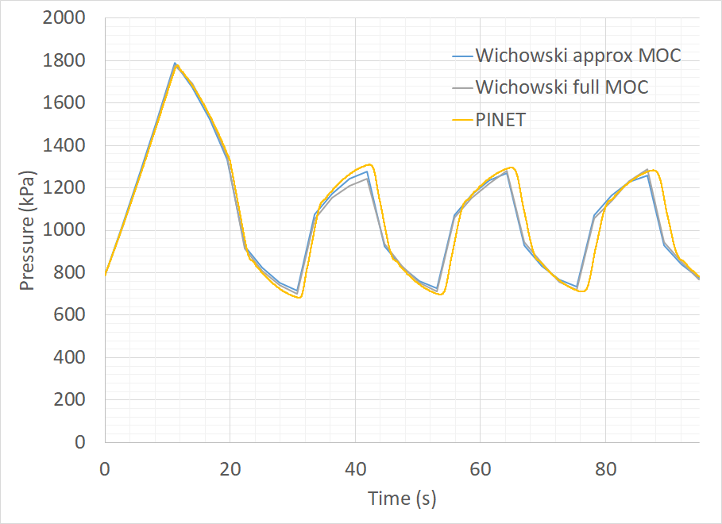
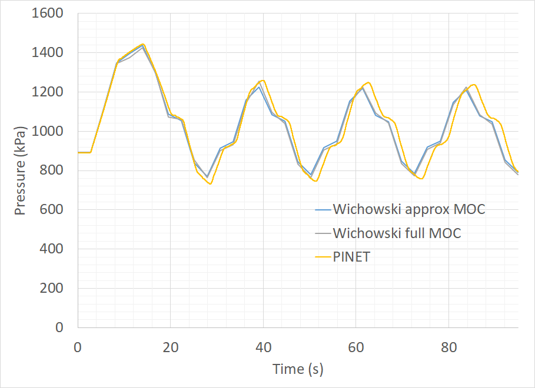

Tutorial 3: Pressure Transients a Water Pipe
============================================

Reference
---------

PINET reference: ``Tutorial 3 - Pressure Transients a water pipe.docx``.

OpenSD files:

* :download:`Input script <../../../tutorials/tutorial3/tutorial.py>`
* :download:`Notebook <../../../tutorials/tutorial3/tutorial.ipynb>`
* :download:`Browser layout <../../../tutorials/tutorial3/geometry.layout.json>`

Problem description
-------------------

This tutorial problem demonstrates the transient modeling in PINET code.

A pipe with an inner diameter of 0.8 m, a wall thickness of 0.019 m, and a length of 6000 m
connected to a reservoir with water is considered. Friction pressure drop shall be calculated
using the Darcy Weisbach friction factor formula with a roughness value of 2 mm. Pipe material
is stainless steel (Youngs modulus = 100 GPa, Poisson's ratio = 0.26). The initial fluid
velocity is 1.5 m/s. The steady-state pressure head in the upper reservoir is 100 m. The
transient pressure in the pipe when a value at the pipe end is closed needs to be estimated.
Valve closure time is 20 s (linear flow reduction to be assumed). The bulk modulus of elasticity
of water is 2.07 GPa, density is 1000 kg/m3, and kinematic viscosity is 1.31 x 10-6 m2/s.

Modeling steps
--------------

1. Create an input file for steady state simulation of the problem similar to that described in Tutorial 1 and 2. Since the fluid (water) properties to be used in are specified in the problem, create, and use a user defined fluid.

2. Add wall to the pipe to account the wall elasticity. Since the wall properties to be used are specified in the problem, create, and use a user defined solid for wall material.

3. Add a transient action for the outlet boundary condition so the valve closes according to the specified time history.

4. Set the scheduler time step and end time in the solver settings.

Results
-------

Verify the pressure evolutions at the outlet and at the half-length of the pipe using the plots below.

   Evolution of Pressure at Pipe Outlet

   Evolution of Pressure at Pipe Half Length
