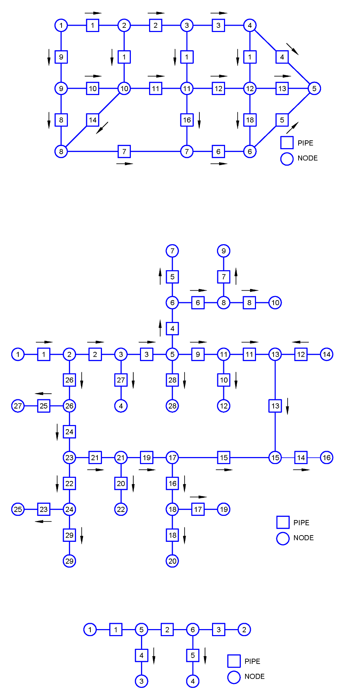
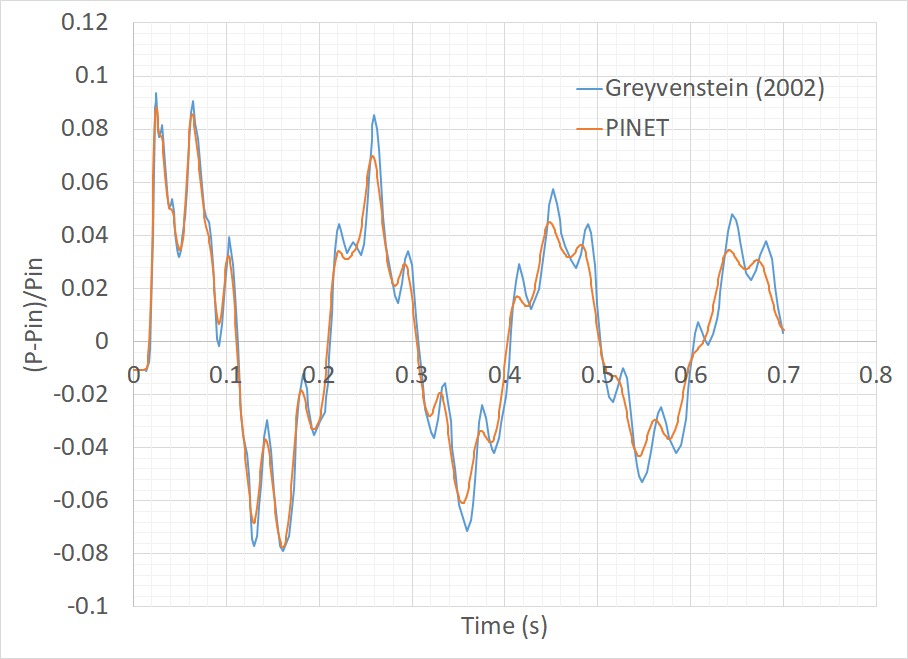

Tutorial 4: Pressure Transients in a helium network
===================================================

Reference
---------

PINET reference: ``Tutorial 4 - Pressure Transients in a helium network.docx``.

OpenSD files:

* :download:`XML builder <../../../tutorials/tutorial4/build_xml.py>`
* :download:`Browser layout <../../../tutorials/tutorial4/geometry.layout.json>`

Problem description
-------------------

A flow circuit with Helium gas as the fluid inside is considered in the schematic. Sudden closure of
valves at the outlet of branches 1 and 2 is the transient condition (instantaneous flow
reduction to zero can be assumed). The evolution of pressure in the circuit at the midpoint of
pipe2 must be estimated. Each pipe has a length of 10 m and a diameter of 0.5 m. A friction
factor of 0.02 can be assumed. Node1 pressure is fixed as 700 kPa. The mass source in node2,
node3, and node 4 are -11.61 kg/s, -12.37 kg/s and -11.61 kg/s respectively.

   Schematic of Flow Circuit

Modeling steps
--------------

1. The steps are similar to that described in tutorial 3.

Results
-------

The evolutions of pressure at point A in the schematic which shall be verified from the code.

   Evolution of Pressure at Pipe2 Midpoint
