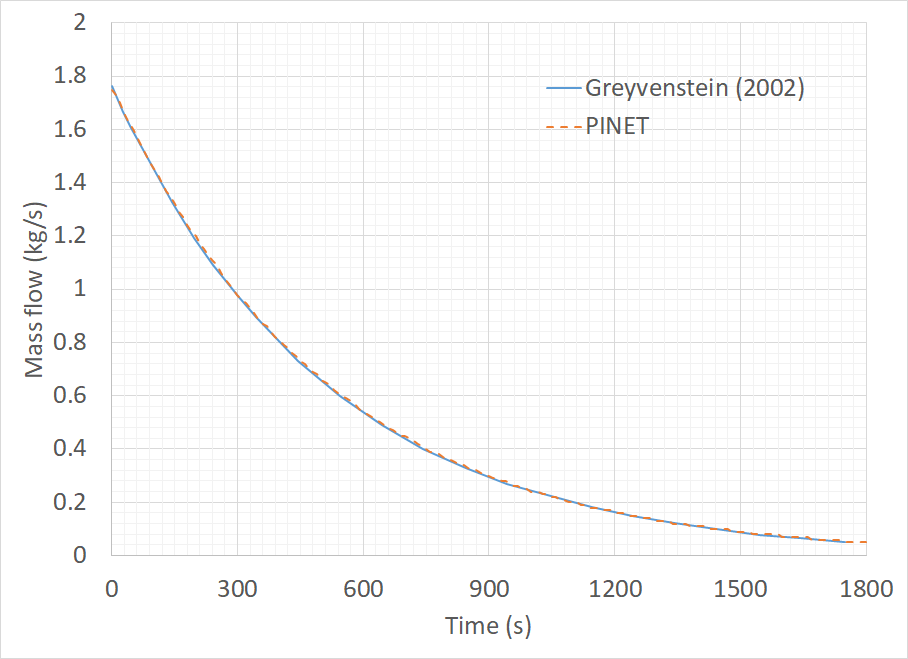

Tutorial 5: Blowdown of a helium tank
=====================================

Reference
---------

PINET reference: ``Tutorial 5 - Blowdown of a helium tank.docx``.

OpenSD files:

* :download:`Input script <../../../tutorials/tutorial5/tutorial.py>`
* :download:`Browser layout <../../../tutorials/tutorial5/geometry.layout.json>`

Problem description
-------------------

In this problem, the blowdown of a pressure vessel through a pipe has been considered. The pipe
has a length of 10 m and a diameter of 0.1 m. The steady-state upstream and downstream pressures
are 700 kPa and 650 kPa, respectively. The pressure in the upstream vessel varies, as shown in
equation (1). Helium is the working fluid.

.. list-table:: Table 1: Reference data
   :widths: auto

   * -  
     -  
     - (1)

Where t is in s. It is required to estimate the transient flow rate through the pipe.

Modeling steps
--------------

1. The steps are similar to those discussed in Tutorial 3 and 4.

Results
-------

The evolution of the mass flow rate in the pipe is shown below, which shall be verified
from the code.

   Evolution of Flow Rate
