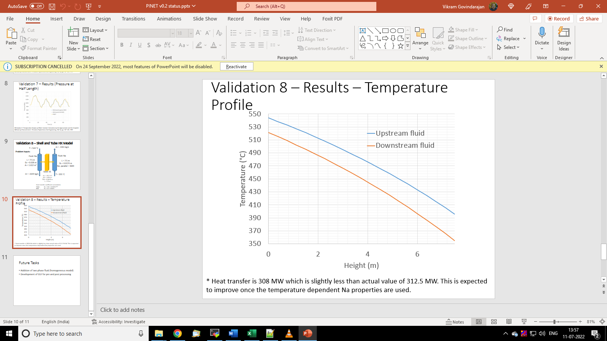

Tutorial 6: Heat Exchanger Modeling
===================================

Reference
---------

PINET reference: ``Tutorial 6 - Heat Exchanger Modeling.docx``.

OpenSD files:

* :download:`Input script <../../../tutorials/tutorial6/tutorial.py>`
* :download:`Browser layout <../../../tutorials/tutorial6/geometry.layout.json>`
* :download:`Sodium fluid file <../../../tutorials/tutorial6/Na6.py>`
* :download:`Tube solid file <../../../tutorials/tutorial6/SS6.py>`

Problem description
-------------------

This tutorial demonstrates the usage of heat slab component that model heat conduction through
solids.

A counter-current straight vertical shell and tube heat exchanger (without baffles) with liquid
sodium on both shell and tube sides is considered. On the shell side, sodium enters at 544
degrees C with a mass flow rate of 1644 kg/s from top to bottom. On the tube side, sodium enters
at a temperature of 355 degrees C with a mass flow rate of 1461 kg/s from bottom to top. The
active heat transfer length is 7.5 m. The tube inner and outer diameters are 17.4 mm and 19 mm,
respectively. There are 3600 tubes in the heat exchanger. The shell's inner diameter is 1.831 m.
The heat transfer coefficient correlations given by equations (1) and (2) shall be used to
estimate the heat transfer on the tube side and shell side, respectively. The total heat
transfer rate in the heat exchanger must be estimated. The material properties for sodium and
tube material shall be used as given in the table below. (As sodium properties are not available in the
CoolProp database, a user-defined fluid is created and used.)

.. list-table:: Table 1: Reference data
   :widths: auto

   * -  
     -  
     - (1)
   * -  
     -  
     - (2)

(Note: This problem approximates the Sodium cooled Fast Reactor (SFR) Intermediate Heat
Exchanger (IHX) conditions)

.. list-table:: Table 2: Material Properties
   :widths: auto

   * -  
     - Property
     - Value
   * - Liquid Sodium
     - Specific Heat
     - 1267 Jkg-1K-1
   * -  
     - Density
     - 860 kg/m3
   * -  
     - Viscosity
     - 3.75E-4 Pas
   * -  
     - Thermal conductivity
     - 70 Wm-1K-1
   * - Tube
     - Thermal conductivity
     - 20 Wm-1K-1

Modeling steps
--------------

1. The shell side and tube side flows are modeled using two pipes in two different circuits and appropriate boundary conditions as discussed in the previous tutorials. The user-defined fluid and solid files for this tutorial are stored in the "tutorials" directory with names Na6.py and SS6.py respectively. In order to enable heat transfer between them, a heat slab component with one layer has to be added between them as shown below: It should be noted that the upstream and downstream areas are specified for the total number of tubes.

2. It is noted that the heat transfer coefficients are specified in the form of scripts as specified in the problem. When specified as script, it takes two arguments namely, flow element block and the wall temperature as shown below: The flow element block has the velocity value at the face and another block called ther_guess which contains all the thermodynamic properties of the fluid. The script should return only h value if the connection is specified as type "pipe". If instead, the type is specified as "pipenl", three values namely Sc, Sp and h are to be returned from the script. This option is used only to get convergence in some cases (e.g., boiling heat transfer where the heat transfer coefficient is non-linear in temperature).

.. list-table:: Table 3: Material Properties (continued)
   :widths: auto

   * - def script1(flow_elem,WallTemp): / Pe = flow_elem.ther_gues.rhomass()\*flow_elem.velocity\*flow_elem.diameter\*flow_elem.ther_gues.cpmass()/flow_elem.ther_gues.conductivity() / Nu = 6 + 0.006\*Pe / h = Nu \* flow_elem.ther_gues.conductivity() / flow_elem.diameter / Sc = h\*flow_elem.stemp_gues / Sp = -h / return Sc,Sp,h / # return h / def script2(flow_elem,WallTemp): / Pe = flow_elem.ther_gues.rhomass()\*flow_elem.velocity\*flow_elem.diameter\*flow_elem.ther_gues.cpmass()/flow_elem.ther_gues.conductivity() / Nu = 4.82 + 0.0185\*Pe\*\*0.827 / h = Nu \* flow_elem.ther_gues.conductivity() / flow_elem.diameter / Sc = h\*flow_elem.stemp_gues / Sp = -h / return Sc,Sp,h / # return h

Results
-------

The temperature profiles of shell side and tube side fluids are shown below. This shall be
verified from the code results.

   Shell Side and Tube Side Sodium Temperature Profiles

The heat transfer rate in the heat exchanger is 308 MW which shall be verified from the code
results. The heat transfer rate from nodal temperatures can be estimated using energy balance as
shown below:

Where subscripts and represents primary (shell side) and secondary (tube side) fluids.
