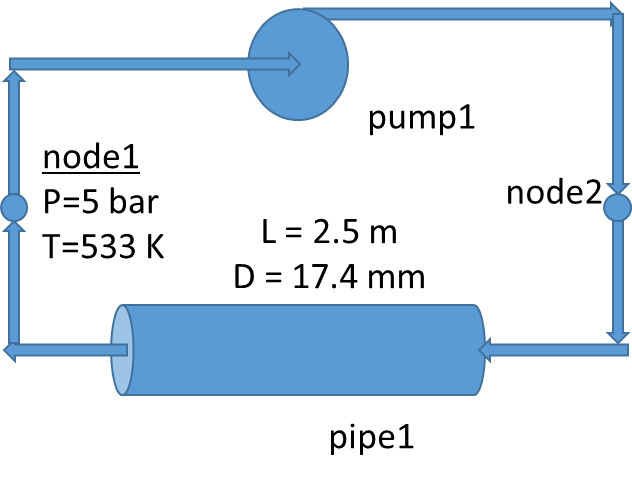
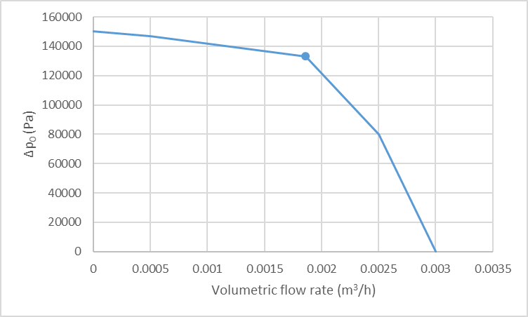

Tutorial 7: Pump Modeling
=========================

Reference
---------

PINET reference: ``Tutorial 7 - Pump Modeling.docx``.

OpenSD files:

* :download:`Input script <../../../tutorials/tutorial7/tutorial.py>`
* :download:`Speed 100 curve <../../../tutorials/tutorial7/speed1.csv>`
* :download:`Speed 50 curve <../../../tutorials/tutorial7/speed2.csv>`
* :download:`Browser layout <../../../tutorials/tutorial7/geometry.layout.json>`

Problem description
-------------------

This tutorial demonstrates the use of pump component in a flow circuit.

The steady-state flow rate in the closed loop filled with liquid sodium shown below needs
to be estimated. The geometry details of the pipe are also given below. The friction
factor in the pipe shall be estimated using Darcy Weisbach equation with roughness of 30 um. The
pump characteristics is shown below (The data points are given in the pump characteristic tables). The evolution
of flow rate when the pump speed linearly decreases to 50 % also needs to be estimated.

   Schematic of the Loop

   Pump Characteristics (speed = 100 shown)

.. list-table:: Table 1: Pump Characteristics Data (Speed = 100)
   :widths: auto

   * - Flow rate (m3/s)
     - 0
     - 0.005
     - 0.00186
     - 0.0025
     - 0.003
   * - Pressure rise (Pa)
     - 150000
     - 147000
     - 132793
     - 80000
     - 0

.. list-table:: Table 2: Pump Characteristics Data (Speed = 50)
   :widths: auto

   * - Flow rate (m3/s)
     - 0
     - 0.005
     - 0.00186
     - 0.0025
     - 0.003
   * - Pressure rise (Pa)
     - 75000
     - 73000
     - 66793
     - 40000
     - 0

Modeling steps
--------------

1. Create nodes 1, 2 and pipe1 using the procedure discussed in the previous tutorials

2. Add a pump component between the specified nodes and attach the two speed-curve CSV files.

3. Note that HQ curves at two speeds 50, 100 are stored in the files speed2.csv, speed1.csv respectively. These files are given in the tutorials directory. The transient action of pump speed reduction is given as a function of (time, delt).

4. Note that the pressure needs to be specified in the circuit in at least one node of a closed loop for a steady-state simulation. Hence, add a boundary condition.

5. Note that the trans parameter is made False and hence the boundary conditions will be disabled in the transient simulation. If temperature is not fixed in the node, then ambient temperature would have been assumed.

6. Relax the transient flow convergence criterion in the solver settings for this pump case. This is a temporary setting used for the pump tutorial.

Results
-------

Verify the following

Volumetric flow rate = 0.00186 m3/s (full speed), 0.001343 (final speed)

Pressure rise across pump = pressure drop across pipe = 1.33 bar (full speed)

(Pump operating point for full speed shown below)

The same tutorial can be tried with homologous pump characteristics also (tutorial7b.py).
