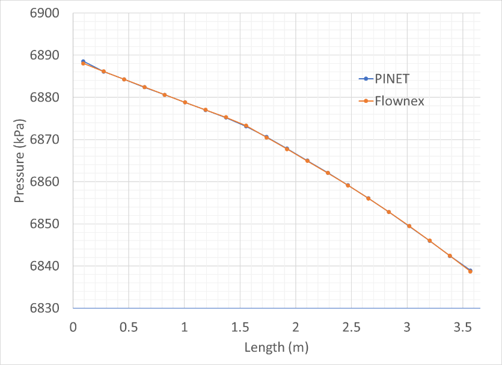
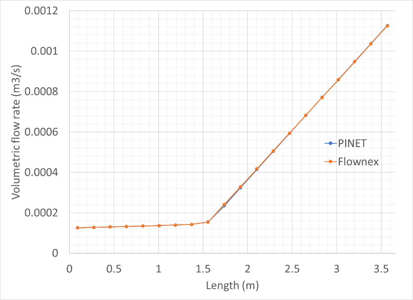

Tutorial 8: Two phase flow in a pipe
====================================

Reference
---------

PINET reference: ``Tutorial 8 - Two phase flow in a pipe.docx``.

OpenSD files:

* :download:`Input script <../../../tutorials/tutorial8/tutorial.py>`

Problem description
-------------------

A vertical tubular section is installed in a high-pressure water loop. The tube is 10.16 mm i.d.
and 3.66 m long, heated uniformly over its length. Water enters the test section at 204 degrees
C and 68.9 bar. The water flow rate is 0.108 kg/s, and a power of 100 kW is applied to the tube
linearly over 10 s. The evolution of outlet quality and profiles at the final steady state are
required to be estimated.

Modeling steps
--------------

Results
-------

The final steady-state results shown below shall be compared with code results.

   Pressure Profile

   Volumetric Flow Rate Profile
