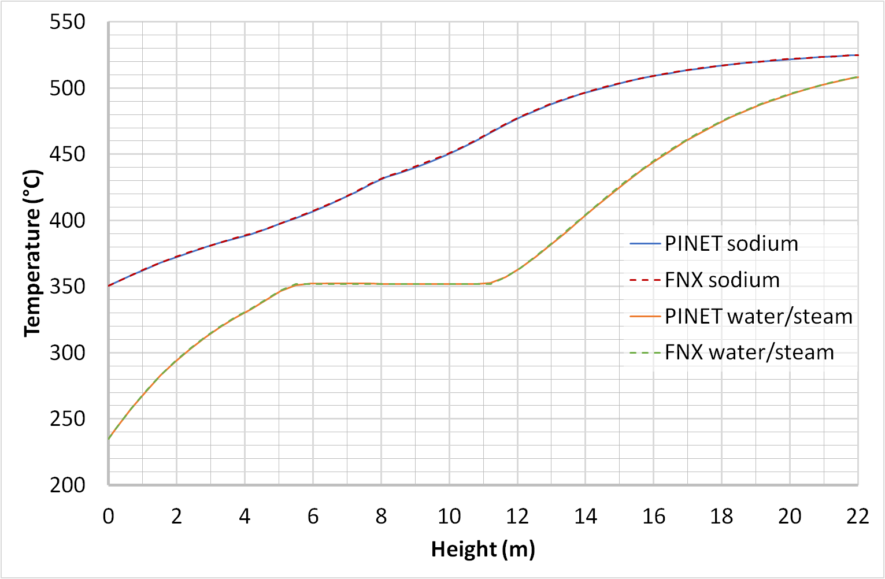
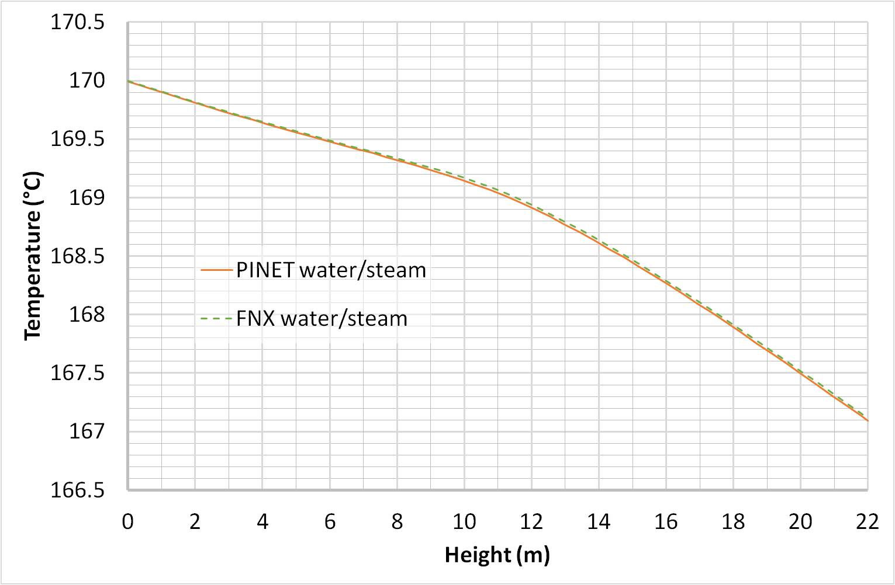

Tutorial 9: Steam Generator Modeling
====================================

Reference
---------

PINET reference: ``Tutorial 9 - Steam Generator Modeling.docx``.

OpenSD files:

* :download:`Input script <../../../tutorials/tutorial9/tutorial.py>`
* :download:`Browser layout <../../../tutorials/tutorial9/geometry.layout.json>`

Problem description
-------------------

A counter-current straight vertical shell and tube heat exchanger (without baffles) with liquid
sodium on the shell side and water on the tube side is considered. On the shell side, sodium
enters at 525 degrees C with a mass flow rate of 730 kg/s from top to bottom. On the tube side,
water enters at a temperature of 235 degrees C, a pressure of 170 bar, and a mass flow rate of
70.3 kg/s from bottom to top. The active heat transfer length is 22 m. The tube inner and outer
diameters are 12.6 mm and 17.2 mm, respectively. There are 547 tubes in the heat exchanger
arranged with a pitch of 32.2 mm. The shell's inner diameter is 0.831 m. The regime-dependant
heat transfer coefficient correlations as described in [20] shall be used to estimate the heat
transfer rates in the shell and tube sides. It is required to estimate the temperature and
pressure profiles in the heat exchanger. The material properties for sodium shall be used as
given in the table below, while that for water can be imported from the CoolProp database. The thermal
conductivity for the tube material can be taken as 23.2 Wm-1K-1.

.. list-table:: Table 1: Material Properties
   :widths: auto

   * -  
     - Property
     - Value
   * - Liquid Sodium
     - Specific Heat
     - 1267 Jkg-1K-1
   * -  
     - Density
     - 860 kg/m3
   * -  
     - Viscosity
     - 3.75E-4 Pas
   * -  
     - Thermal conductivity
     - 70 Wm-1K-1
   * - Tube
     - Thermal conductivity
     - 20 Wm-1K-1

Modeling steps
--------------

Results
-------

The steady-state temperature and pressure profiles are shown below
respectively which shall be compared with the code results.

   Steady-State Temperature Profile for Problem 3.4.2

   Steady-State Pressure Profile for Problem 3.4.2
